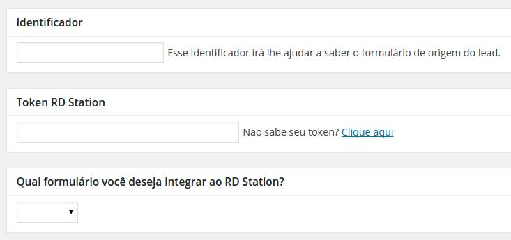

# RD Station - WordPress

Dúvidas e Sugestões? [https://github.com/ResultadosDigitais/rdstation-wp/issues](https://github.com/ResultadosDigitais/rdstation-wp/issues)

[**Como integrar**](#como-integrar)
* [Compatibilidade](#compatibilidade)
* [Instalação](#instalação)
* [Configuração](#configuração)
	* [Contact Form 7](#contact-form-7)
	* [Gravity Forms](#gravity-forms)
* [Múltiplas Integrações](#múltiplas-integrações)
* [Campos personalizados](#campos-personalizados)
* [Mapeamento de campos](#mapeamento-de-campos)

[**Como contribuir**](#como-contribuir)
* [Fork do repositório](#fork-do-repositório)
* [Criando novas integrações](#criando-novas-integrações)
	* [Metaboxes](#metaboxes)
		* [Criando o metabox de formulário para sua integração](#criando-o-metabox-de-formulário-para-sua-integração)
	* [Envio dos leads para o RD Station](#envio-dos-leads-para-o-rd-station)

[Dúvidas e sugestões](https://github.com/ResultadosDigitais/rdstation-wp/issues)

## Como integrar

Com este plugin você pode integrar qualquer formulário do seu site ou blog e ter controle sobre esses formulários integrados.

Endereço oficial: [https://wordpress.org/plugins/integracao-rd-station/](https://wordpress.org/plugins/integracao-rd-station/)

### Compatibilidade

O plugin **RD Station** atualmente é compatível com os seguintes plugins de formulário:

* VIA API
** [Contact Form 7](#contact-form-7)
** [Gravity Forms](#gravity-forms)
* VIA Script
** Inserção do script gerado pelo RD diretamente nas páginas.

### Instalação

Se o seu site ou blog foi desenvolvido pela Resultados Digitais, este plugin já está instalado e você pode pular para a parte de [configuração](#configuração). Caso contrário, siga estes passos:  

Você pode instalar o plugin diretamente pelo seu painel do WordPress, clicando em **Plugins**, **Adicionar novo** e pesquise por **RD Station**. Provavelmente será o único plugin a aparecer nos resultados da pesquisa. Basta clicar em **Instalar** e depois em **Ativar**. Seu plugin está funcionando e você já pode pular para a parte de configuração.

Caso você prefira instalar o plugin manualmente, você pode baixá-lo [clicando neste link](https://github.com/ResultadosDigitais/rdstation-wp/archive/master.zip) ou baixando o arquivo ZIP diretamente pelo [endereço oficial](https://wordpress.org/plugins/integracao-rd-station/).

Para instalá-lo no seu site, você precisa entrar no seu painel do WordPress, clicar em **Plugins**, **Adicionar novo** e depois em **Fazer upload do plugin**. Então selecione o arquivo que você baixou e clique em **Instalar agora**. Se o plugin foi instalado com sucesso, clique em **Ativar plugin**.

### Configuração

Depois de instalar o plugin, irá aparecer um item no seu menu WordPress, de acordo com o plugin de formulários que você tem instalado e ativo. Se você tem o Contact Form 7, irá aparecer **RD Station CF7**, já se você tiver o Gravity Forms, irá aparecer **RD Station GF**.
Se você tiver os dois formulários instalados, ambos estarão ativos no seu menu, e você pode usar os dois formulários simultaneamente sem problemas.
Caso os formulários não tenham sido gerados por esses plugins não aparecerá nenhum novo item no menu.
No entanto, dentro das páginas e posts será aberto uma área para inserção de scripts de integração RD Station.

#### Contact Form 7

A integração no Contact Form 7 só irá funcionar com formulários que possuem um campo de **email** mapeado com o campo de email do RD Station. Sem esse campo, a API do RD Station não realiza a conversão dos leads.

Para fazer uma integração, clique no item **RD Station CF7** que apareceu no menu do seu painel. Para criar uma nova integração, basta clicar em **Criar integração** e preencher os dados solicitados no formulário.

Crie um título para sua integração, apenas para organizar suas integrações e encontrá-la posteriormente no seu painel.

No campo **Identificador**, crie um Identificador para seu formulário. Isso é importante para você saber qual o formulário de origem do *lead*.  

Por último, selecione qual formulário você deseja integrar. Este campo traz uma lista com todos os formulários criados no Contact Form 7.  

Clique em **Integrar**. Pronto, seu formulário escolhido está integrado ao RD Station.


#### Gravity Forms

Para a integração com o Gravity Forms funcionar, você precisa ter pelo menos um campo do tipo **e-mail** no seu formulário.  
Veja como criar campos do tipo e-mail no Gravity Forms na [Central de Ajuda do RD Station](http://ajuda.rdstation.com.br/hc/pt-br/articles/205542309)

Para fazer uma integração, clique no item **RD Station GF** que apareceu no menu do seu painel. Após isso o processo para criar uma nova integração é o mesmo do Contact Form 7: clique em **Criar integração** e preencha os dados solicitados no formulário.

Siga os mesmos passos usados no [Contact Form 7](#contact-form-7)

Clique em **Integrar** e seu formulário escolhido está integrado ao RD Station.

#### Integração de scripts RD Station

Para integração via script é necessário criar um script através do RD Station no menu Conta>Integrações>Integração de Formulário.

Após o script gerado e copiado, acesse o painel de controle do wordpress e na página da qual contém o formulário que gerou o script,
no final da tela de edição aparecerá a área "Integração de script RD Station".
Inserir o script gerado pelo RD Station no campo "Área para inserção do script de integração de formulário antes do fechamento do </body>"

E atualize a edição clicando no botão Atualizar no menu direito do wordpress.

### Múltiplas integrações
Você pode integrar quantos formulários for necessário. Além disso, você também pode integrar um único formulário a mais de uma conta no RD Station, criando duas integrações com tokens diferentes. Isso pode ser útil quando você criar alguma campanha com um parceiro, e precisa gerar o lead para as duas contas.

### Campos personalizados

Para que os dados de um campo do formulário sejam enviados como campo personalizado para o seu RD Station, você só precisa criar um campo no formulário com o mesmo nome definido no RD Station. Por exemplo, se você tem um campo personalizado chamado **idioma**, você só precisa criar um campo no seu formulário com `name="idioma"`.

### Mapeamento de campos

Quando um formulário é criado, os campos são gerados com nomes não amigáveis, por exemplo: input_1, input_2, input_3... Em consequencia disto, os leads chegam no RD Station de uma forma difícil de ser identificada.

Na página de configuração das integrações, você pode definir o nome de cada campo do seu formulário. Você pode dizer, por exemplo, que o campo `input_1` vai se chamar `nome` e o `input_2` será cidade.

## Como contribuir

Você pode contribuir com o plugin, criando novas integrações e sugerindo melhorias. Para isto, basta abrir uma *issue* relatando algum erro ou fazendo uma sugestão, ou abrir um *Pull Request* com alguma nova funcionalidade ou correção de erro.

### Criando novas integrações

#### Metaboxes



O plugin gera os metaboxes para o `Identificador` e `Token RD Station` automaticamente.  

Cada plugin de formulário tem uma forma específica de chamar os formulários cadastrados, portanto, o campo de seleção dos formulários não é gerado automaticamente.  

##### Criando o metabox de formulário para sua integração

Para gerar esse campo, você precisa criar um arquivo dentro da pasta `metaboxes`.  

O nome do arquivo deve ser a concatenação das letras `rd` com a sigla do plugin. Para o Contact Form 7, por exemplo, criamos o nome da seguinte forma: `rdcf7.php`. Para o Gravity Forms, ficou assim: `rdgf.php`.

No arquivo que você criou, é preciso chamar o `RD_Metabox.php` e criar uma classe herdando a `RD_Metabox`. Essa classe também precisa ter a regra de nomenclatura citada acima (rd + abreviação do plugin), só que com **letras maiúsculas**.  

Você precisa também ter uma função chamada `form_id_box_content`. Ela que irá renderizar o conteúdo na tela.  

Veja um exemplo abaixo:

```php
<?php

	require_once('RD_Metabox.php');

	class RDCF7 extends RD_Metabox {

		function form_id_box_content(){

		    // Retorna um select com os formulários criados

		}

	}

?>
```

#### Envio dos leads para o RD Station

Cada plugin de formulário tem sua particularidade, portanto precisamos criar uma função separada para cada plugin que iremos fazer a integração. Hoje temos as funções `contact_form_7` e `gravity_forms`.  

Para criar uma regra de envio dos leads, você precisa criar uma função dentro do arquivo `lead_conversion.php`.  

Dentro desta função, você precisa recuperar os dados que o usuário preencheu no formulário. Você precisa armazenar estes dados como uma array dentro de `$this->form_data`.

Após isso, você precisa chamar uma função para gerar alguns campos estáticos obrigatórios na conversão. Nesta função, você passa como parâmetros o identificador do formulário e o nome do plugin que você está integrando. Por exemplo:  

```php
$this->generate_static_fields($form->ID, 'Plugin Contact Form 7');
```

Depois de gerar os campos estáticos, basta chamar a função que realiza a conversão, e passar a variável `$this->form_data` como parâmetro, como no exemplo abaixo:  

```php
$this->conversion($this->form_data);
```

O resultado da função irá ficar algo parecido com isso:  

```php
public function contact_form_7($cf7){
		// Crie suas regras para obter os dados enviados no formulário

		// Atribua os dados obtidos à variável $this->form_data
		$this->form_data = $posted_data;

		// Chame a função que irá gerar os campos estáticos
		$this->generate_static_fields($form->ID, 'Plugin Contact Form 7');

		// Chame a função que irá realizar o envio para o RD Station
		$this->conversion($this->form_data);
	}
```

Feito isso, tudo que você precisa é chamar todas estas configurações no arquivo principal do plugin, desta forma:

```php
new RD_Custom_Post_Type ( $acronym, $name, $slug, $plugin_path );
new LeadConversion($callback, $submit_action);
```

**$acronym**

Nome do plugin abreviado, com letras maísculas. Por exemplo: CF7

**$name**

Nome completo do plugin, por exemplo: Contact Form 7

**$slug**

rd + sigla do plugin, em letras minúsculas. Exatamente o mesmo nome que você usou no arquivo de metabox. Ex.: `rdcf7`

**$plugin_path**

Caminho do plugin de formulário de contato que você está integrando (`pasta-do-plugin/nome-do-plugin.php`). Por exemplo: `contact-form-7/wp-contact-form-7.php`.

**$callback**

Nome completo do plugin, com letras minúsculas e separados por `_`. Ex.: `contact_form_7`.

**$submit_action**

Nome da função de envio do plugin de formulário. No Contact Form 7, por exemplo, é: `wpcf7_mail_sent`

Veja um exemplo com o Contact Form 7:

```php
$contact_form_7 = new RD_Custom_Post_Type ( 'CF7', 'Contact Form 7', 'rdcf7', 'contact-form-7/wp-contact-form-7.php' );
new LeadConversion('contact_form_7', 'wpcf7_mail_sent');
```

Estas são as alterações necessárias para criar uma nova integração. Existem atualmente duas integrações criadas, tente usá-las como exemplo para facilitar a criação de uma nova.  

[Dúvidas e sugestões?](https://github.com/ResultadosDigitais/rdstation-wp/issues)